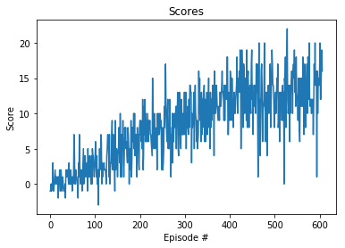

# Learning Algorithm

The agent that solves the environment is trained using **Double Deep Q Networks** . The local and target networks have two hidden fully connected layers with 128 units.  The agent starts exploring with `eps=1`and decays at a rate of 0.995. The environment is solved in approximately 600 episodes. 

# Rewards

The following figure exhibits the reward obtained in each of the 607 episodes. The trainings stops after reaching an average reward of +13 in 100 consecutive episodes.

## Ideas for Future Work

Several things might be implemented in order to improve the algorithm performance in the context of value-based methods. In particular, prioritized experience replay and dueling deep Q networks. 

Additionally, certain hyperparameters such as the number of hidden layers and number of units of the networks, might be adjusted in order to imrpove the results using grid search or bayesian optimization.

# 